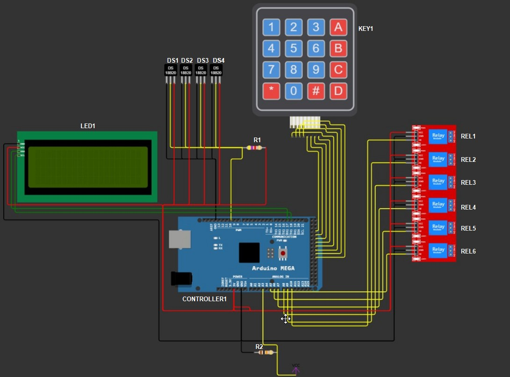

 
 

Принципиальная схема
--------

  

<h3 align="center">Принципиальная схема</h1>
  

| Элемент     | Назначение | Устройство |
| ---      | ---  | ---  |
| LED1 | Используется для отображения информации и выбора режима работы | LCD 2004 SPI |
| DS1    | Герметичный датчик температуры DS18B20, используется для измерения температуры котла        |
| DS2 | Герметичный датчик температуры DS18B20, используется для измерения температуры теплового аккумулятора        |
| DS3 | герметичный датчик температуры DS18B20, используется для измерения температуры теплового аккумулятора         |
| DS4 | `         |
| KEY1 | `         |
| R1 | `         |
| R2 | `         |
| CONTROLLER1 | `         |
| REL1 | `         |
| REL2 | `         |
| REL3 | `         |
| REL4 | `         |
| REL5 | `         |
| REL6 | `         |

Детали
--------
* Arduino Mega 2560 Rev3 [LINK](https://arduino.ua/ru/prod243-arduino-mega-2560-rev3) Плата управления
* LCD 2004 I2C [LINK](https://arduino.ua/ru/prod1932-lcd-2004-i2c-simvolnii-displei-20x4-jeltii) Экран для отображения информации
* DS18B20 [LINK](https://arduino.ua/ru/prod414-temperatyrnii-datchik-vodonepronicaemii-ds18b20) Водонипроницаемый датчик измерения температуры
* 8-ми канальный модуль твердотельного реле 5В 2А [LINK]([https://www.adafruit.com/products/757](https://arduino.ua/ru/prod1415-8-mi-kanalnii-modyl-tverdotelnogo-rele-5v-2a-low-level)) Твердотельное реле для управления нагрузкой
* Клавиатура матричная 4х4 [LINK](https://arduino.ua/ru/prod316-klaviatyra-matrichnaya-4h4) Клавиатура для ввода данных и управления системой
* Подстроечный резистор 3296W (1 кОм) [LINK](https://arduino.ua/ru/prod5553-podstroechnii-rezistor-3296w-1-kom-1sht) Обвязка

Библиотеки
---------
* `arduino/libraries/U8glib` [LINK](https://www.arduino.cc/reference/en/libraries/u8glib/) Библиотека для работы с LCD дисплеем (в нашем варианте по шине I2C)
* `arduino/libraries/Keypad`[LINK](https://playground.arduino.cc/Code/Keypad/) Библиотека для упрощения работы с матричной клавиатурой
* `arduino/libraries/DallasTemperature`[LINK](https://playground.arduino.cc/Code/Timer1/) Библиотека для измерения температуры при помощи датчика DS18B20 
* `arduino/libraries/TimerOne`[LINK](https://playground.arduino.cc/Code/Timer1/) Библиотека для реализации многопоточности
* `arduino/libraries/PWMrelay` [LINK](https://github.com/GyverLibs/PWMrelay) Библиотека для управления нагрузкой на твердотельном реле 
